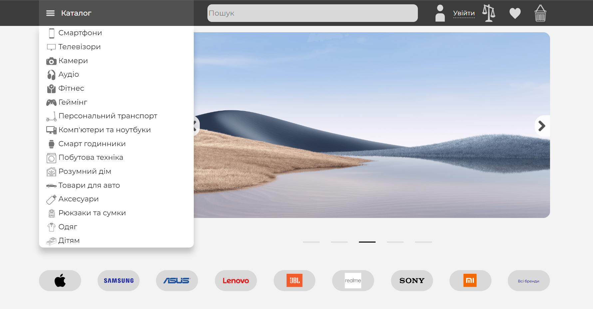
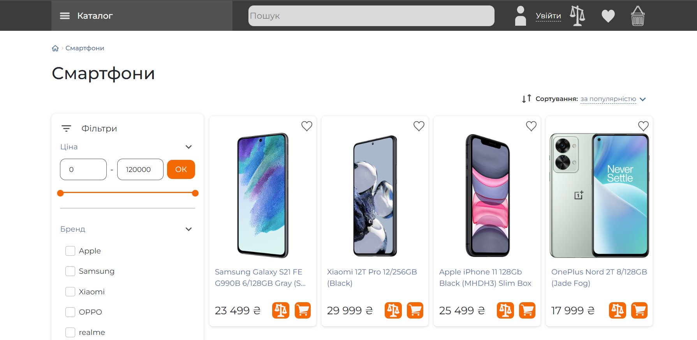
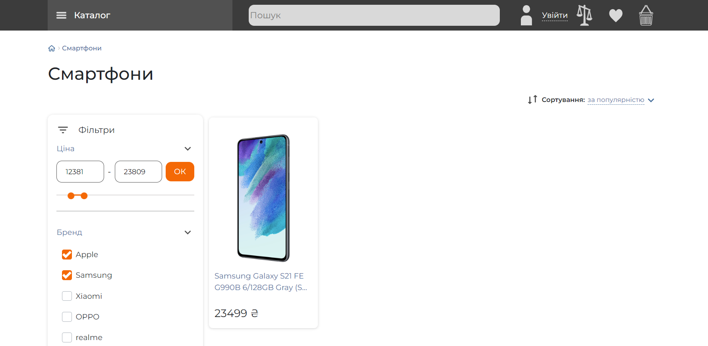
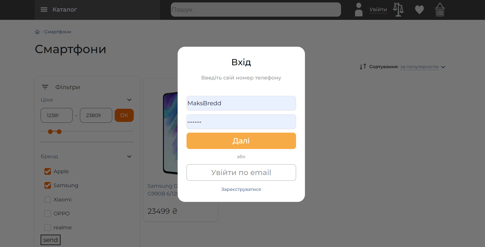
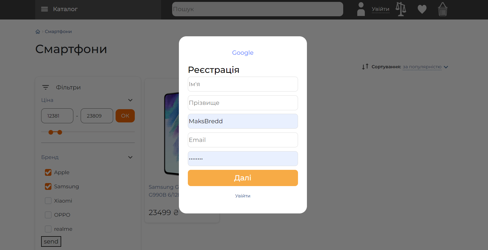
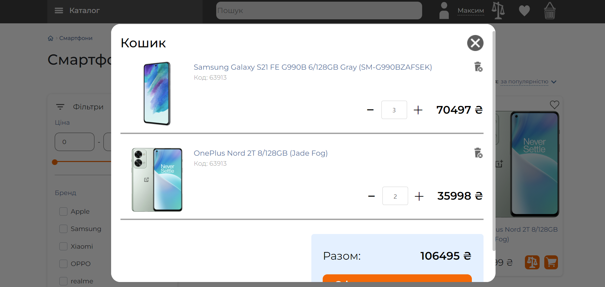

# OnlineStore 








A wonderful site for the sale of various goods, with registration functions, baskets, catalog, main page and filters.

To launch this repository, you need to take the following steps:
<br/> Step 1

```
git clone https://github.com/MaksMBO/OnlineStore.git
```
Step 2 You need to create virtual environment on your pc: for Windows
```
python -m venv [Virtual Environment Name]
```
for Linux/Mac

```
python3 -m venv [Virtual Environment Name]
```
Step 3 You need to activate your virtual invironment virtual environment: for Windows
```
.\[Virtual Environment Folder Name]\Scripts\activate
```
for Linux/Mac
```
source [Virtual Environment Name]/bin/activate
```
Step 4 You need to install all project dependencies:
```
pip install -r requirements.txt
```
Step 5 You need to create all database tables on your local machine:
```
python manage.py migrate
```
Step 6 Finally start project:
```
python manage.py runserver
```